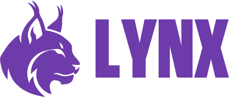
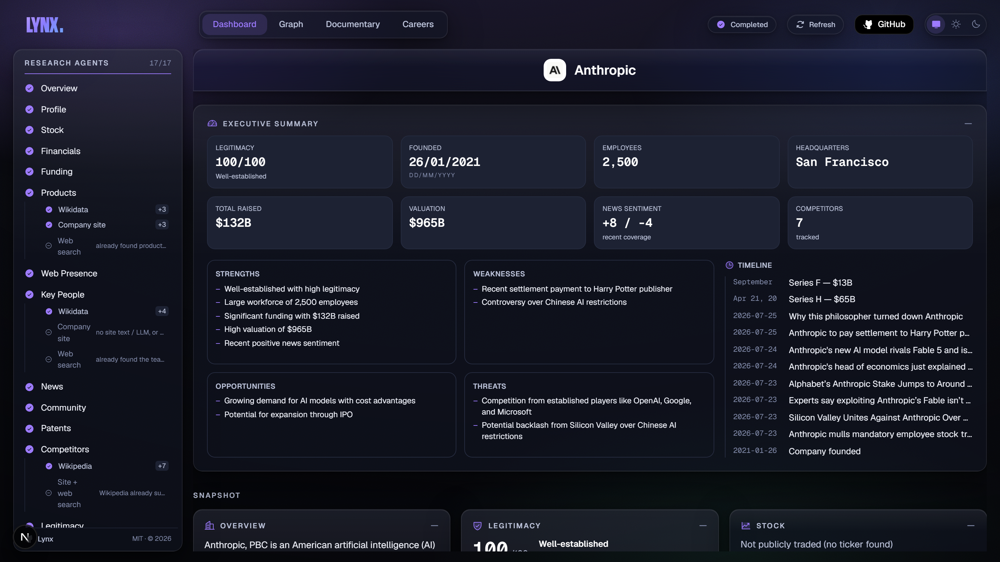
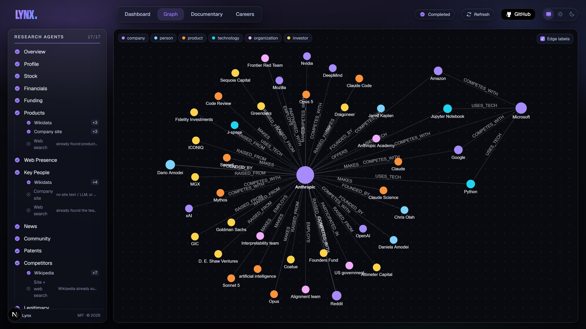
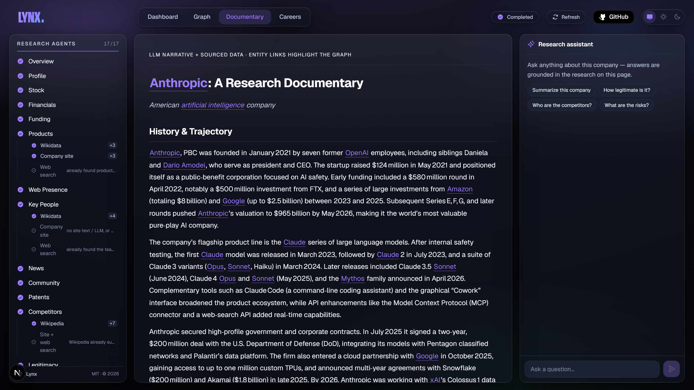
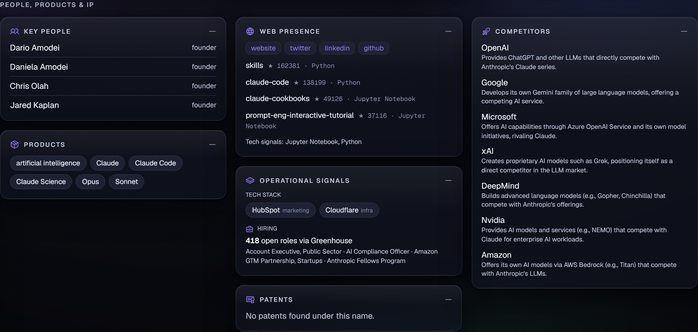
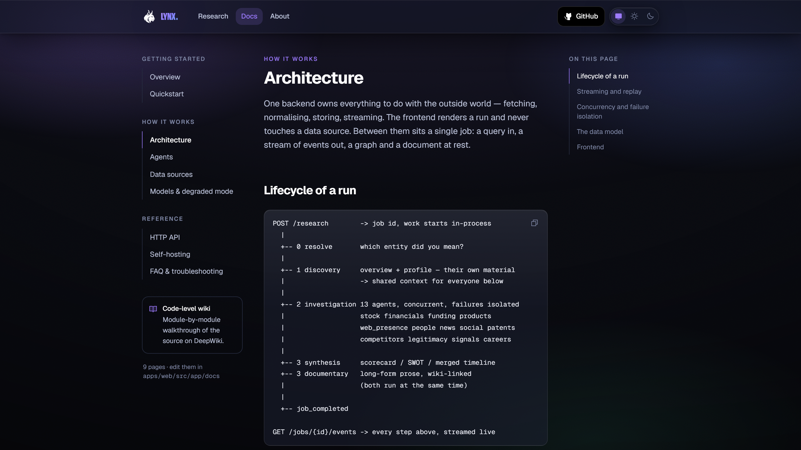
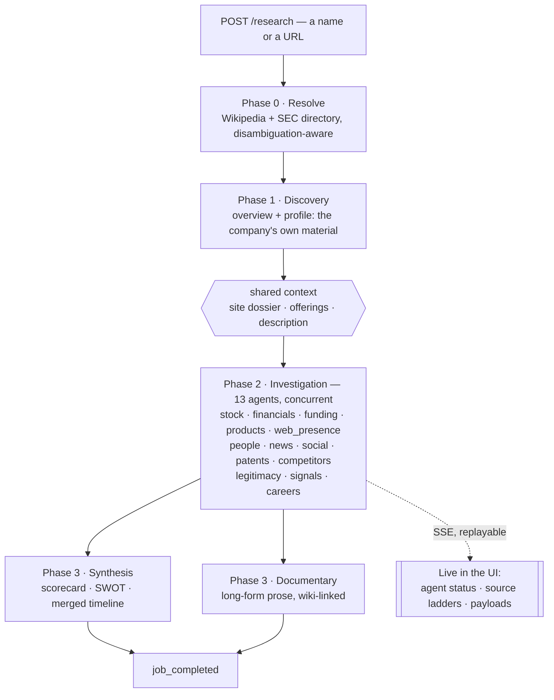
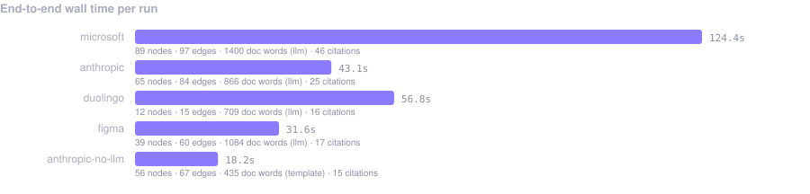
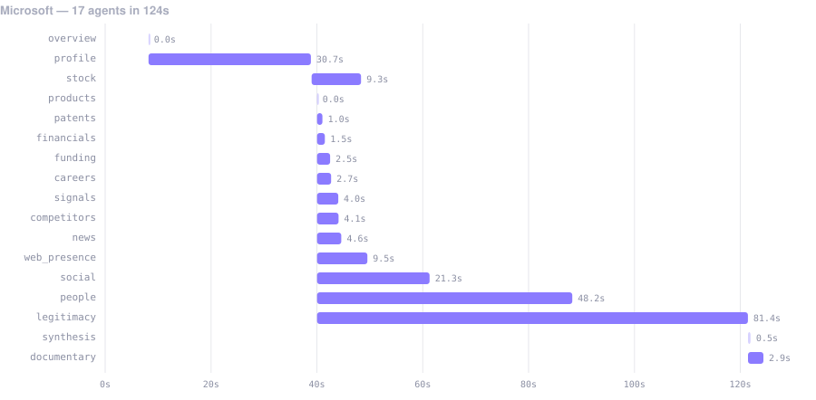
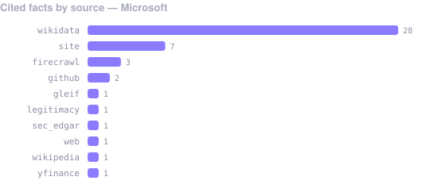

<p align="center">
  <picture>
    <source media="(prefers-color-scheme: dark)" srcset="apps/web/public/brand/lynx-logo-horizontal-white.svg">
    
  </picture>
</p>

<h1 align="center">See any company clearly</h1>

<p align="center">
  Type a company or paste a URL. Fifteen research agents fan out across public sources and return a
  <br>live dashboard, a knowledge graph, a written documentary, and the roles they're hiring for.
</p>

<p align="center">
  <a href="https://github.com/ronak-create/Lynx/actions/workflows/ci.yml"></a>
  <a href="LICENSE"></a>
  
  
  
  <a href="https://discord.gg/XdMmjD5qU"></a>
</p>

<p align="center">
  <b><a href="#quickstart">Quickstart</a></b> ·
  <b><a href="#how-a-run-works">How it works</a></b> ·
  <b><a href="#measured-performance">Benchmarks</a></b> ·
  <b><a href="https://deepwiki.com/ronak-create/Lynx">Code wiki</a></b> ·
  <b><a href="https://discord.gg/XdMmjD5qU">Discord</a></b>
</p>

<p align="center">
  
</p>

---

Researching a company properly means opening the same twenty tabs every time: an encyclopaedia for
the outline, EDGAR for the numbers, the site for what they actually sell, news for what just
happened, a jobs board to see whether they're really hiring, a registry to check they exist at all.
The hard part was never finding any one of those. It's holding them side by side.

**Lynx does the assembly.** One query fans out to fifteen agents, each owning a single question and
walking a ladder of sources from most authoritative to most improvised, and every fact that comes
back carries the source it came from. It runs with **no API keys at all** — a language model is
optional, and only does the work a parser genuinely can't.

*Named for the lynx, proverbially sharp-sighted. That's the whole job.*

## Contents

- [What you get](#what-you-get)
- [Quickstart](#quickstart)
- [How a run works](#how-a-run-works)
- [Measured performance](#measured-performance)
- [Data sources](#data-sources)
- [Configuration](#configuration)
- [Deploy](#deploy)
- [Project layout](#project-layout)
- [Tests and CI](#tests-and-ci)
- [Known limits](#known-limits)
- [Contributing](#contributing)

## What you get

| | View | What it is |
| --- | --- | --- |
| 📊 | **Dashboard** | A card per category, filling in live as each agent lands, layered into sections and led by a synthesised executive summary: scorecard, SWOT, and a timeline merged from founding, funding, filings, news and patents. |
| 🕸 | **Knowledge graph** | A force-directed map of ~9 entity types and ~22 relationship types. Click any node for its facts, its citations, and its connections. |
| 📄 | **Documentary** | A generated long-form write-up whose entities are wiki-linked and cross-highlight the graph, with a chat assistant grounded strictly in that run's data. |
| 💼 | **Careers** | Open roles pulled live from public ATS boards, faceted by department and location. Boards only serve open roles, so every listing is verified live. |

Plus **compare mode** — project two or more finished runs onto shared metric rows, winner
highlighted — and a **diff banner** showing what moved since the last time you researched the same
entity.

<details>
<summary><b>More screenshots</b></summary>
<br>
<p align="center">
  <br>
  <sub><em>Knowledge graph — click a legend tag to isolate a category.</em></sub>
</p>
<p align="center">
  <br>
  <sub><em>Documentary — wiki-linked entities cross-highlight the graph, with a grounded chat assistant.</em></sub>
</p>
<p align="center">
  <br>
  <sub><em>Search — pick a model, toggle categories, add provider keys (kept in your browser).</em></sub>
</p>
<p align="center">
  
  
</p>
<p align="center">
  <br/>
  <sub><em>Documentation ships inside the app at <code>/docs</code> — quickstart through API reference.</em></sub>
</p>
</details>

## Quickstart

**Prerequisites** — Node 20+ with pnpm (`corepack enable pnpm`) and [`uv`](https://docs.astral.sh/uv/),
which provisions Python 3.12 for you.

```bash
git clone https://github.com/ronak-create/Lynx.git && cd Lynx
cp .env.example .env               # runs fine as-is; set CONTACT_EMAIL (SEC requires one)

cd apps/api && uv sync && cd ../..
pnpm install

pnpm dev                           # FastAPI on :8000, Next.js on :3000
```

Open <http://localhost:3000>, type a company, hit enter. Try `Microsoft` (public: filings, XBRL
financials, live quote), `Anthropic` (private: stock gracefully absent), and `https://figma.com`
(URL input: resolution starts from the site itself).

Adding one free LLM key (e.g. Groq) to `.env` switches on entity extraction, per-node analysis and
the written documentary. Everything else already worked without it.

## How a run works



Three ideas do most of the work:

- **Source ladders.** An agent doesn't query one API — it walks a ranked list and stops at the first
  rung that answers. The people agent tries Wikidata, then the company's own site, then web search
  over press coverage. Every rung's outcome is streamed, so a thin answer reads as *"the two good
  sources had nothing"* rather than looking like a bug.
- **Isolated failure.** Agents run in a task group with per-agent timeouts and exception isolation.
  A source being down costs you one card, never the run.
- **The model is optional.** Structured data is parsed deterministically; the LLM is used only for
  extraction from prose and for writing prose. The no-LLM path is a tested first-class mode.

Full detail: [architecture](https://deepwiki.com/ronak-create/Lynx) and the in-app docs at `/docs`.

## Measured performance

Every number below came from `docs/bench.py`, which drives the public API, times each agent from the
event stream, and writes a JSON record. The records are committed in
[`docs/benchmarks/`](docs/benchmarks) — regenerate them and this section describes *your* machine.

```bash
cd apps/api
uv run python ../../docs/bench.py "Microsoft" --label microsoft
uv run python ../../docs/bench_report.py        # charts + summary table
```

<p align="center">
  
</p>

| run | query | wall | agents | graph | documentary | cited facts |
| --- | --- | ---: | ---: | ---: | --- | ---: |
| `microsoft` | Microsoft | 124.4s | 17/17 | 89n / 97e | 1400 words (llm) | 46 |
| `duolingo` | Duolingo | 56.8s | 17/17 | 12n / 15e | 709 words (llm) | 16 |
| `anthropic` | Anthropic | 43.1s | 17/17 | 65n / 84e | 866 words (llm) | 25 |
| `figma` | https://figma.com | 31.6s | 17/17 | 39n / 60e | 1084 words (llm) | 17 |
| `anthropic-no-llm` | Anthropic (no model) | 18.2s | 17/17 | 56n / 67e | 435 words (template) | 15 |

Read that last row carefully: **with no model configured at all, all seventeen passes still
completed** and produced a graph and a document. That is the degraded path, not an error state.

The per-agent timeline is where the design shows up — one slow discovery crawl, then thirteen agents
overlapping, then synthesis and the documentary running concurrently at the end:

<p align="center">
  
</p>

And every fact is attributable — here is where a single run's cited facts actually came from:

<p align="center">
  
</p>

<details>
<summary><b>Reading these numbers honestly</b></summary>
<br>

- **Cache state matters.** Responses are cached with per-source TTLs, so re-running an entity is much
  faster than the first look. `duolingo` was a first-ever run; `anthropic` had a warm cache.
- **The graph is cumulative per entity.** Nodes persist across runs, so a company you've researched
  repeatedly has a denser graph than a first run of the same size company.
- **Free tiers throttle.** Groq's free tier is ~12k tokens/minute; back-to-back heavy runs will
  rate-limit, and the run degrades rather than failing.
- **Wall time is dominated by the slowest agent**, not by their sum — 81s of the Microsoft run is the
  legitimacy agent walking RDAP, TLS, DNS, Wayback and the LEI registry.
- Machine: Windows 11, single API process, SQLite in WAL mode, live network.

Full tables, including slowest agent and source-ladder rungs per run: [`docs/benchmarks/summary.md`](docs/benchmarks/summary.md).
</details>

## Data sources

All free by default; most need no key at all.

| Group | Sources |
| --- | --- |
| **Registries & filings** | SEC EDGAR (XBRL facts + filings), GLEIF LEI registry, RDAP, PatentsView |
| **Reference & archive** | Wikipedia, Wikidata, Wayback Machine |
| **Markets** | Yahoo Finance |
| **Coverage & community** | Google News RSS, Hacker News (Algolia), Reddit, X syndication, Trustpilot |
| **The company itself** | Site crawl (Jina Reader → Firecrawl → httpx), tech fingerprint, TLS handshake, DNS-over-HTTPS |
| **Code & hiring** | GitHub, Greenhouse, Lever, Ashby, SmartRecruiters |
| **Search** | DuckDuckGo HTML → DuckDuckGo Lite → Firecrawl |

Both ladders put the metered option **last**, which is why Lynx researches JS-heavy sites and private
companies with no Firecrawl key — the key only raises the ceiling on hard pages.

Every request goes through one HTTP layer with a shared cache, per-source rate limits, and a
User-Agent carrying your `CONTACT_EMAIL`. Adding a source — including a paid one — is a single module
returning the same typed records; agents don't change.

## Configuration

| Variable | Default | Notes |
| --- | --- | --- |
| `CONTACT_EMAIL` | `anonymous@example.com` | Sent in the User-Agent. SEC EDGAR requires a real address. |
| `LLM_CHAIN` | `groq,cerebras,openrouter,ollama` | Order providers are tried in; unkeyed ones are skipped |
| `GROQ_API_KEY` / `GROQ_MODEL` | — / `llama-3.3-70b-versatile` | Any one provider is enough |
| `CEREBRAS_API_KEY` / `CEREBRAS_MODEL` | — / `llama-3.3-70b` | |
| `OPENROUTER_API_KEY` / `OPENROUTER_MODEL` | — / `…llama-3.3-70b-instruct:free` | |
| `OLLAMA_BASE_URL` / `OLLAMA_MODEL` | `localhost:11434/v1` / — | Set the model to enable; fully local, no key |
| `FIRECRAWL_API_KEY` | — | Optional; last rung of both ladders |
| `CORS_ORIGINS` | `localhost:3000` | Browser origins the API accepts |
| `DATABASE_PATH` | `data/research.db` | SQLite; schema is Postgres-portable |
| `MAX_CONCURRENT_FETCHES` | `16` | Global outbound cap |

Per-run choices — model and which categories to run — live behind **Model & options** on the search
page and are sent with each request. Provider keys can also be entered per-browser there; they stay
in memory unless you tick **Save config**, and are never stored server-side.

## Deploy

```bash
cp .env.example .env
docker compose up --build          # API on :8000, web on :3000
```

The database and HTTP cache persist in the `research-data` volume. For a real deployment set two
things:

- **`NEXT_PUBLIC_API_URL`** — the API origin the browser calls, baked in at web **build** time
- **`CORS_ORIGINS`** — the web origin(s) the API accepts

The images are independent (`apps/api/Dockerfile`, `apps/web/Dockerfile`), so they can be deployed
separately on any container host.

> [!WARNING]
> The API has no authentication. Anyone who can reach it can start runs — spending your provider
> credits — and read every stored run. Keep it behind your own auth proxy or on a private network.

## Project layout

```
apps/api/src/app/
  sources/      one adapter per data source (fetch → normalize → typed record)
  agents/       orchestrator + one agent per category + entity resolution
  jobs/         async job manager, SSE fan-out with event replay
  graph/        entity resolution/dedup + LLM extraction schema
  llm/          provider-agnostic client, fallback chain, per-run selection
  documentary/  documentary generator (LLM + template fallback)
  rag/          grounded retrieval for the Documentary chat assistant
  db/           SQLAlchemy models (Postgres-portable)

apps/web/src/
  app/          / (search) · /research/[jobId] · /compare · /docs · /about
  components/   cards, GraphView, NodePanel, DocumentaryView, DocChat, CareersView
  hooks/        useJobEvents (SSE with Last-Event-ID replay)
  stores/       highlight (cross-view), settings + theme (persisted)

docs/
  bench.py          benchmark one run → docs/benchmarks/<label>.json
  bench_report.py   those records → the charts and tables above
  shoot.py          regenerate the screenshots
```

## Tests and CI

```bash
cd apps/api && uv run pytest                 # 48 tests: normalizers, resolution, dedup,
                                             # SEC matching, LLM fallback, layers, synthesis
cd apps/web && pnpm exec tsc --noEmit && pnpm lint
```

CI runs all three on every push and pull request. Normalisers are pure functions and the most
valuable thing to test — they're also what breaks when a provider changes shape.

## Known limits

- **SEC XBRL for older fiscal years** occasionally picks up a mis-tagged value; recent years are
  accurate. Isolated in `sources/sec_edgar.py`.
- **Market data is scraping-based** and can break; it degrades to "quote unavailable" rather than
  failing the run.
- **Reddit 403s** from many hosts, so the community agent falls through to web search.
- **PatentsView's** free endpoint moved behind a key; the agent degrades to empty.
- **DuckDuckGo** answers bursts with 202/403; the ladder falls through, and a Firecrawl key helps.
- **Runs live in the API process** — restarting the backend marks in-flight jobs failed rather than
  leaving them streaming forever.

## Contributing

Issues and PRs are welcome — a source changing shape is the single most common failure in a tool like
this, and reports of it are genuinely useful. Start with [CONTRIBUTING.md](CONTRIBUTING.md) for
conventions, or come to [Discord](https://discord.gg/XdMmjD5qU).

- **Adding a data source** — one module in `sources/` returning the shared typed records, plus a
  `REGISTRY` entry and a rate limiter.
- **Adding an agent** — one module in `agents/` exposing `category` and `run(ctx)`, registered in the
  orchestrator. Always `session.commit()` before emitting; holding a write transaction across an
  emit self-deadlocks SQLite.
- Keep the default path free and keyless: paid sources must degrade to nothing when unconfigured.

Security reports: see [SECURITY.md](SECURITY.md). Everyone participating is expected to follow the
[Code of Conduct](CODE_OF_CONDUCT.md).

## License

[MIT](LICENSE) © Ronak Parmar

<sub>Lynx aggregates publicly available information. Results are a starting point for your own
diligence — not legal, financial or investment advice.</sub>
